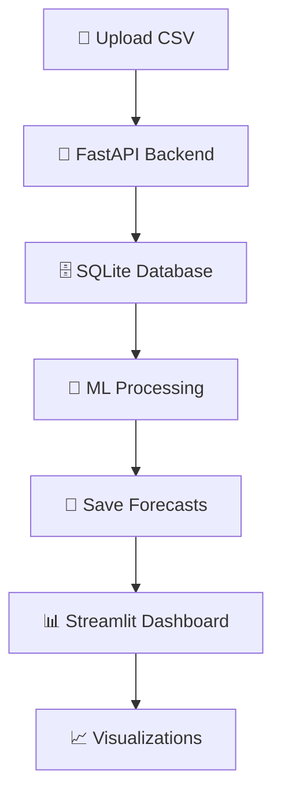

# 🚀 Sistema de Vendas & Previsões ML

   

Sistema completo de análise de vendas com inteligência artificial para previsão de receita e demanda, desenvolvido com **FastAPI**, **Streamlit** e **Machine Learning**.

## 🌐 Aplicação Online (Render.com)

### 🔗 URLs de Acesso
- **🖥️ Backend API:** https://ecommerce-backend-i2wg.onrender.com
- **📖 Documentação API:** https://ecommerce-backend-i2wg.onrender.com/docs
- **📊 Frontend:** Execute localmente (instruções abaixo)

### 🔐 Login Padrão
- **Email:** `admin@admin.com`
- **Senha:** `admin`

---

## 🏗️ Arquitetura do Sistema

```
📊 CSV Import → 🚀 FastAPI → 🗄️ SQLite → 🤖 ML Engine → 📈 Streamlit Dashboard
```

### 🛠️ Stack Tecnológica
- **Backend:** FastAPI 0.104.1 + SQLAlchemy 1.4.50
- **Banco:** SQLite com persistência no Render
- **Autenticação:** JWT com SHA256 hashing
- **ML:** Python nativo (Holt-Winters/ETS)
- **Frontend:** Streamlit com visualizações Plotly
- **Deploy:** Render.com (Python 3.10.12)

---

## 🚀 Execução Local

### 📋 Pré-requisitos
- Python 3.10+ 
- pip
- Git

### ⚡ Instalação Rápida

```bash
# 1. Clone o repositório
git clone https://github.com/VictorBrasileiroo/Ecommerce-ACE2.git
cd ACE2

# 2. Instale as dependências
pip install fastapi==0.104.1 uvicorn[standard]==0.24.0 sqlalchemy==1.4.50 python-multipart==0.0.6 python-jose[cryptography]==3.3.0 streamlit plotly pandas requests

# 3. Execute o Frontend (conecta automaticamente ao backend online)
streamlit run frontend/app.py --server.port 8501
```

### 🌐 Acessar Aplicação
- **Frontend Local:** http://localhost:8501
- **Backend Online:** https://ecommerce-backend-i2wg.onrender.com

---

## 📊 Funcionalidades

### 🔑 **Sistema de Autenticação**
- ✅ Login/Cadastro seguro com JWT
- ✅ Isolamento de dados por usuário
- ✅ Hash SHA256 para senhas

### 📈 **Dashboard Inteligente**
- ✅ **Métricas principais:** Receita total, ticket médio, produtos únicos
- ✅ **Visualizações:** Evolução mensal, top produtos, análise por categoria
- ✅ **Alertas inteligentes:** Metas, crescimento, recomendações

### 🤖 **Machine Learning**
- ✅ **Previsão de receita:** Algoritmos de série temporal
- ✅ **Ranking de produtos:** Produtos com maior potencial
- ✅ **Análise de tendências:** Projeções futuras automáticas

### 📊 **Importação de Dados**
- ✅ **Upload CSV:** Interface drag-and-drop
- ✅ **Validação:** Preview antes da importação
- ✅ **Processamento:** Parsing nativo sem pandas

---

## 🔌 API Endpoints

| Método | Endpoint | Descrição | Autenticação |
|--------|----------|-----------|--------------|
| `POST` | `/auth/login` | Login JWT | ❌ |
| `POST` | `/auth/register` | Cadastro usuário | ❌ |
| `POST` | `/import` | Upload CSV vendas | ✅ |
| `GET` | `/metrics` | KPIs do dashboard | ✅ |
| `GET` | `/forecast` | Previsões ML | ✅ |
| `POST` | `/run-ml` | Executar ML | ✅ |

### 📝 Formato CSV Esperado
```csv
data,produto,categoria,preco,quantidade,valor_total
2024-01-15,Notebook Dell,Eletrônicos,2500.00,2,5000.00
2024-01-20,Mouse Logitech,Periféricos,150.00,5,750.00
```

---

## 🗄️ Banco de Dados

### 📊 Esquema (SQLAlchemy)
```python
# Usuários
usuarios: id, email, senha_hash

# Produtos  
produtos: id, nome, categoria, preco

# Vendas
vendas: id, data, produto_id, usuario_id, quantidade, valor_total

# Previsões ML
forecast: id, produto_id, data_prevista, qtd_prevista, intervalo_conf
```

---

## 🤖 Machine Learning

### 🧠 Algoritmos Implementados
- **Holt-Winters Exponential Smoothing**
- **Seasonal Decomposition**
- **Trend Analysis**

### 📈 Outputs do ML
- **Previsão de receita mensal**
- **Ranking de produtos por potencial**
- **Intervalos de confiança**
- **Detecção de sazonalidade**

---

## 🎨 Screenshots

### 🔐 Tela de Login


### 📊 Dashboard Principal


### 📈 Análise de Vendas


### 🤖 Previsões ML


---

## 🚀 Deploy (Render.com)

### ⚙️ Configurações
```yaml
# Build Command
pip install -r requirements.txt

# Start Command  
uvicorn backend.main:app --host 0.0.0.0 --port $PORT

# Environment
Python 3.10.12
```

### 📦 Dependências (requirements.txt)
```txt
fastapi==0.104.1
uvicorn[standard]==0.24.0
sqlalchemy==1.4.50
python-multipart==0.0.6
python-jose[cryptography]==3.3.0
```

---

## 📖 Documentação Completa

### 📋 Documentos Disponíveis
- **[Frontend Requirements](./FRONTEND_REQUIREMENTS.md)** - Especificações completas para desenvolvimento frontend
- **[API Documentation](https://ecommerce-backend-i2wg.onrender.com/docs)** - Swagger UI interativo
- **[Database Schema](./docs/database_schema.md)** - Documentação do banco de dados

### 🔧 Guias de Desenvolvimento
- **[Setup Local](./docs/local_setup.md)** - Configuração ambiente local
- **[Deploy Guide](./docs/deploy_guide.md)** - Tutorial de deploy
- **[ML Algorithm](./docs/ml_algorithms.md)** - Documentação dos algoritmos

---

## 🎯 Uso Prático

### 1️⃣ **Primeiro Acesso**
```bash
# Execute o frontend
streamlit run frontend/app.py --server.port 8501

# Acesse: http://localhost:8501
# Login: admin@admin.com / admin
```

### 2️⃣ **Importar Dados**
- 📊 Clique em "Importar Dados"
- 📁 Upload arquivo CSV
- ✅ Confirme a importação

### 3️⃣ **Executar ML**
- 🤖 Clique "Executar ML" no dashboard
- ⏳ Aguarde processamento (30-60s)
- 📈 Visualize previsões geradas

### 4️⃣ **Analisar Resultados**
- 📊 Métricas principais no topo
- 📈 Gráficos de evolução
- 🔮 Previsões ML detalhadas
- 🏆 Ranking de produtos

---

## 🔄 Fluxo de Dados



---

## 🏆 Features Destacadas

### ✨ **Inovações**
- 🔐 **JWT Authentication** - Segurança enterprise
- 🤖 **ML Automático** - Previsões com 1 clique
- 📊 **Dashboard Real-time** - Atualizações automáticas
- 🌐 **Cloud Ready** - Deploy simplificado
- 📱 **Responsive Design** - Interface adaptativa

### 🎨 **UX/UI**
- 🎯 **Interface intuitiva** - Navegação simples
- 📊 **Visualizações interativas** - Plotly charts
- 🚨 **Alertas inteligentes** - Insights automáticos
- 🔄 **Auto-refresh** - Dados sempre atuais
- 🎨 **Tema profissional** - Design moderno

---

## 🔧 Troubleshooting

### ❌ **Problemas Comuns**

#### 🚫 Erro de Conexão
```bash
# Verifique se o backend está online
curl https://ecommerce-backend-i2wg.onrender.com/docs

# Se offline, aguarde ~50s (spin up automático)
```

#### 📊 Dados não aparecem
```bash
# Verifique se fez login
# Confirme se CSV foi importado corretamente
# Execute o ML para gerar previsões
```

#### 🤖 ML não executa
```bash
# Verifique se tem dados importados
# Backend pode levar 30-60s para processar
# Veja logs no terminal do Streamlit
```

---

## 🤝 Contribuição

### 📋 **Como Contribuir**
1. 🍴 Fork o projeto
2. 🌿 Crie sua branch (`git checkout -b feature/AmazingFeature`)
3. ✅ Commit changes (`git commit -m 'Add AmazingFeature'`)
4. 🚀 Push branch (`git push origin feature/AmazingFeature`)
5. 🔄 Abra Pull Request

### 🐛 **Report de Bugs**
- Use as [Issues do GitHub](https://github.com/VictorBrasileiroo/Ecommerce-ACE2/issues)
- Inclua screenshots e logs
- Descreva passos para reproduzir

---

## 📞 Suporte

### 📧 **Contato**
- **GitHub:** [@VictorBrasileiroo](https://github.com/VictorBrasileiroo)
- **Repository:** [Ecommerce-ACE2](https://github.com/VictorBrasileiroo/Ecommerce-ACE2)

### 🔗 **Links Úteis**
- **API Live:** https://ecommerce-backend-i2wg.onrender.com
- **Docs API:** https://ecommerce-backend-i2wg.onrender.com/docs
- **Render Status:** [render.com](https://render.com)

---

## 📄 Licença

Distribuído sob a licença MIT. Veja `LICENSE` para mais informações.

---

## 🚀 Próximos Passos

### 🎯 **Roadmap 2024**
- [ ] 🌐 Deploy do frontend no Render
- [ ] 📧 Notificações por email
- [ ] 📱 Versão mobile (React Native)
- [ ] 🔄 Sync automático com ERPs
- [ ] 🤖 ML mais avançado (LSTM, Prophet)
- [ ] 📊 Dashboards personalizáveis
- [ ] 🔐 Multi-tenancy
- [ ] 📈 Analytics avançado

---

**🎉 Desenvolvido com ❤️ para análise inteligente de vendas**
